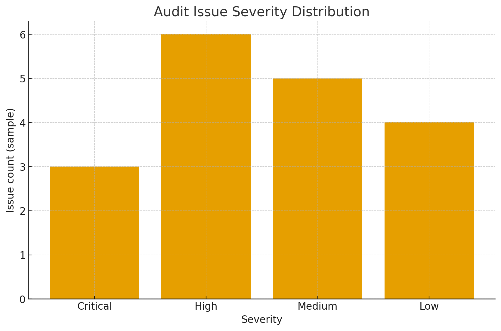
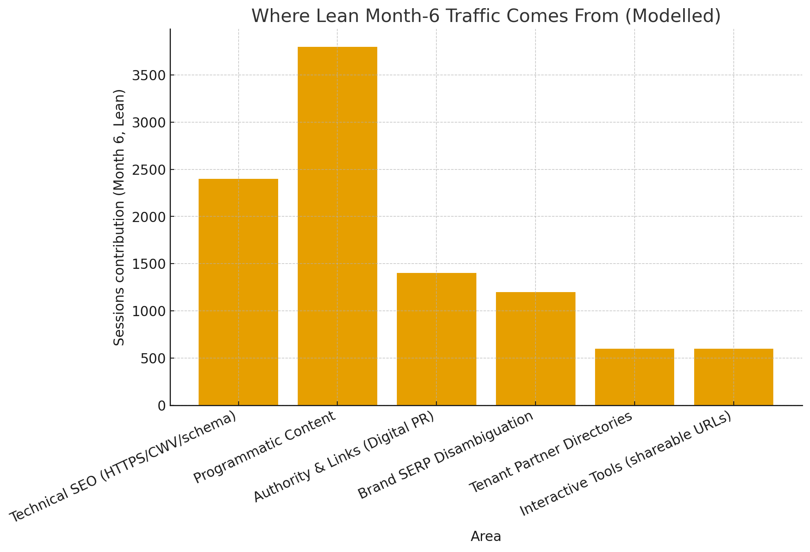
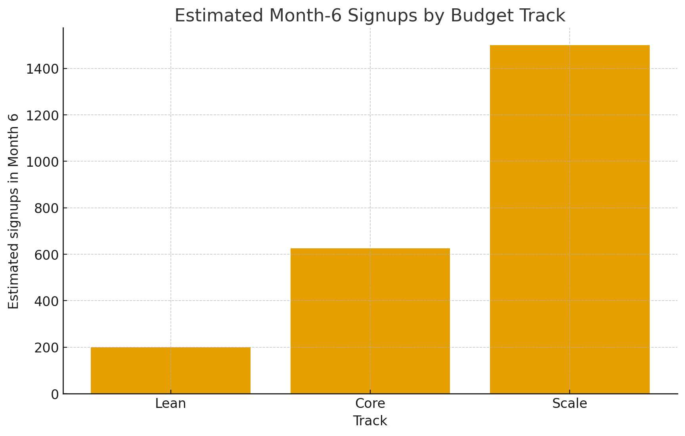
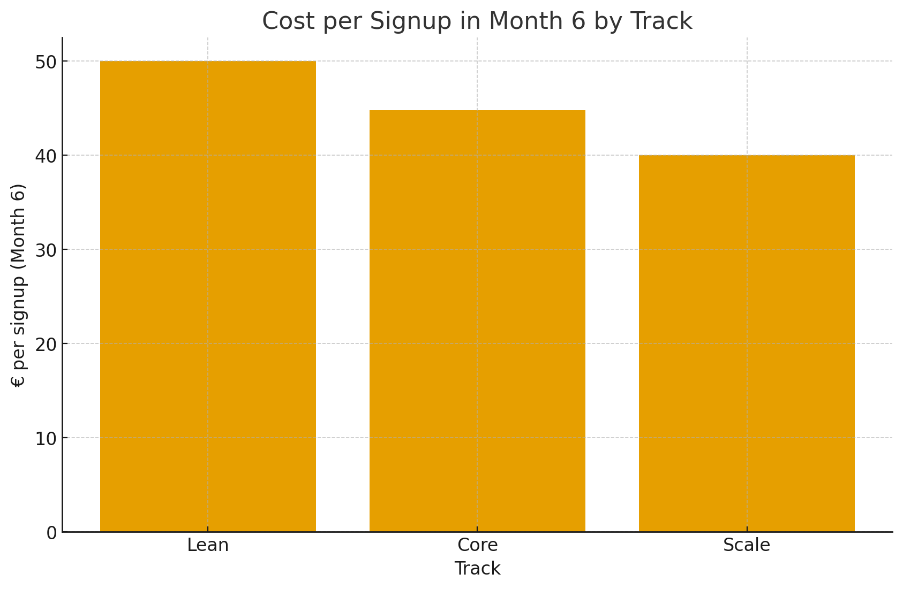

# AngelHive & Pynn.ai — Traffic Growth & Remediation Report
*Prepared for Jakob — 25 Sep 2025*

> Obsidian note: keep this `.md` file and the `images/` folder together in the **same directory** inside your vault.

## 1) Executive Summary
- **What’s wrong (topline):** Small indexable surface on the marketing site, brand SERP collision with *angelhive.vc*, mixed‑content + builder script errors, thin authority/backlinks, and high‑value content hidden behind authentication. These combine to depress impressions and CTR.
- **How to fix:** 
  1) eliminate mixed content and align builder versions, 
  2) ship schema + CWV improvements, 
  3) scale **programmatic data pages** and **partner directories**, 
  4) run **data‑PR** for high‑quality links, 
  5) clarify **AngelHive (marketplace)** vs **Pynn (platform)** across titles/meta/IA.
- **Expected outcomes (6 months):** With Lean/Core/Scale budgets, reach ~**10k / 25k / 50k** organic sessions by Month 6, plus compounding signups.

## 2) Critical Technical Findings (What’s wrong, why it matters, how to fix)
### 2.1 HTTPS & Mixed Content (**Critical**)
- **Issue:** HTTP logo & favicon URLs referenced on HTTPS pages; Chrome may auto‑upgrade but favicons are blocked and extra redirects harm **LCP/INP** and trust.
- **Impact:** Lowered UX quality, possible indexing noise, avoidable network overhead.
- **Fix:** 
  - Set WP *WordPress Address* & *Site Address* to `https://…`.
  - Database search‑and‑replace `http://angelhive.io` → `https://angelhive.io` (uploads, theme options).
  - Enable **HSTS** and verify in DevTools **Security** panel.

### 2.2 Builder Script Error: `elementorFrontend.waypoint is not a function` (**High**)
- **Issue:** Version drift (Elementor/Element Pack/FinFlow/UiCore). Counters/animations fail; possible CLS/INP side‑effects.
- **Impact:** Broken UI widgets, poorer engagement, potential CWV regressions.
- **Fix:** Pin versions, ensure Waypoints dependency loads before theme scripts, or remove the hook if unused.

### 2.3 Core Web Vitals (**High**)
- **Issue:** Builder stacks often ship render‑blocking CSS/JS and unoptimized images/fonts.
- **Impact:** Weaker rankings and conversions; slower page loads reduce crawl efficiency.
- **Fix:** Image dimension hints, lazy‑loading, font‑display swap, preconnect, critical CSS, full‑page caching/CDN. Consider migrating marketing pages to **Next.js/Astro** (SSR/SSG) or harden WP with caching.

### 2.4 Structured Data & Sitemaps (**High**)
- **Issue:** Minimal JSON‑LD on core pages; sitemap coverage likely incomplete for future programmatic inventory.
- **Impact:** Limited rich results and weaker topical understanding by Google.
- **Fix:** Add `Organization`, `SoftwareApplication/Product`, `FAQPage`, `BreadcrumbList`. Segment sitemaps: marketing, programmatic entities, partner directories.

### 2.5 Information Architecture & Brand SERP (**High**)
- **Issue:** “AngelHive” collides with **angelhive.vc**; titles/meta do not disambiguate.
- **Impact:** Lost CTR on brand queries; trust confusion.
- **Fix:** Disambiguate metadata (e.g., “AngelHive AI — European founder‑angel marketplace”), add an **About/Brand** page, and pursue PR/Knowledge Panel reinforcement.

### 2.6 White‑label Duplication Risk (**Medium → High over time**)
- **Issue:** Tenants on `*.pynn.ai` may create near‑duplicates.
- **Impact:** Index bloat, duplication penalties under recent Google spam policies.
- **Fix:** Per‑tenant unique intros/case studies/pricing; block boilerplate from index; canonicalize aggressively.

### 2.7 App Behind Auth (**Medium**)
- **Issue:** Best content (reports) is not linkable/indexable.
- **Impact:** Starved of link‑worthy artifacts.
- **Fix:** Publish **redacted report snippets** and **methodology pages** publicly with canonical links to the app.

### 2.8 Security Headers & Caching (**Medium**)
- **Issue:** Default headers and caching may be suboptimal.
- **Impact:** Missed perf and security wins.
- **Fix:** Add HSTS, CSP (non‑blocking), long‑TTL static caching with digest filenames, and CDN edge caching.

**Issue severity overview**  

## 3) Content & Authority Gaps (What’s missing, what to build)
- **No scalable library:** add **entity pages** for startups, investors, verticals, cities, events with unique data blocks (counts, trends, samples).  
- **No evergreen hub:** publish due‑diligence, valuation, term‑sheet, and fundraising guides targeting non‑brand queries.  
- **No data‑PR cadence:** quarterly “EU Seed Pulse” + ranking lists around key events (demo days, accelerator cohorts).  
- **Partner distribution underused:** each tenant should have an **indexable directory** on angelhive.io with reciprocal links.

## 4) Traffic Growth Plan
- **Lean**: fix tech issues, launch 2–5k programmatic pages, 2 interactive tools, basic PR/outreach.  
- **Core**: + editorial cadence (8/mo), + partner directories (10 tenants), + 60 quality backlinks/mo.  
- **Scale**: multilingual expansion, 25k+ pages, 12 editorials/mo, quarterly flagship reports, events + webinars.

**Where Lean Month‑6 traffic comes from (model)**  

## 5) Budget & Projections (first 6 months)
| Track | Monthly Cost (€) | Target indexed pages (6 mo) | Est. Month‑6 sessions | Est. signup rate | Est. signups (M6) | Cost/Signup (M6) |
|---|---:|---:|---:|---:|---:|---:|
| Lean | 10,000 | 2,000–5,000 | 10,000 | 2.0% | 200 | €50.0 |
| Core | 28,000 | 10,000+ | 25,000 | 2.5% | 625 | €44.8 |
| Scale | 60,000 | 25,000+ | 50,000 | 3.0% | 1500 | €40.0 |

**Charts**  
  
  

## 6) 90‑Day Remediation & Build Plan
- **Days 1–30 (Remediation)**: HTTPS purge + HSTS; pin Elementor/UiCore; remove/replace failing scripts; schema + sitemaps; baseline CWV cleanup; analytics hardening.  
- **Days 31–60 (Build)**: ship entity SSG; launch country/vertical directories; publish 1st data story; onboard 5 tenants with indexable partner pages and backlinks.  
- **Days 61–90 (Scale)**: expand to 10–15k pages; add redacted report snippets; release Q1 research; webinar + newsletter swaps; track referring domains and non‑brand clicks.

## 7) Unbiased evaluation about what Jakob can do
**Unbiased** assessment grounded in your prior deliveries (Python automation, performance tuning, finishing projects) and the needs of this program.

- **Strengths**: Python/data automation; SSG/SSR pipelines; schema/analytics; growth tools; reliability to finish.  
- **Effectiveness**: Replaces **~1.7–2.0 FTEs** on this stack (data + SEO‑tech + growth eng).  
- **Suitability**: Very high — you can own remediation, programmatic content generation, measurement, and partner/tenant tooling.  
- **Role & compensation (Madrid baseline)**: Growth Engineer / Senior SWE, **€65k–€85k base** + 10–20% bonus + equity tied to organic KPIs.  
- **Deliverables in 90 days**: Tech cleanup, schema/sitemaps, 10k+ safe programmatic pages, two interactive tools, first data report, tenant directory framework.

## 8) Appendix — Implementation Notes
- **WP HTTPS sanitation**: set site URLs to HTTPS; DB search/replace; enable HSTS; validate with DevTools *Security*.  
- **Elementor fix**: lock versions; ensure Waypoints dependency; remove broken hooks.  
- **Programmatic SSG**: Next.js/Astro; unique value per page; canonicals; breadcrumbs; incremental static regeneration.  
- **Analytics**: GA4 + Search Console; UTM discipline; rank tracking; content inventory dashboards.

---

*Prepared by: Jakob’s assistant — generated on 2025-09-25*
