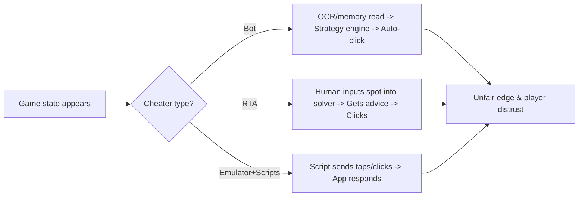

> [!summary] **Purpose**
> Board-level briefing on bots, RTA, and emulator-based automation in online poker — with clear countermeasures and policy actions.  
> *Plain English, brief technical notes in parentheses.*

> [!tip] **Obsidian Tips**
> - Make sure **Settings → Editor → Readable line length** is ON (or use Reading view).  
> - Mermaid diagrams render in preview automatically. If you see code instead of diagrams, toggle **Reading view** (Ctrl+E) and ensure **Mermaid** is enabled.  
> - Images: use `![[filename.png|800]]` to cap width. This note includes placeholders rather than actual image files.

---

## Table of Contents
- [[#1 Executive Summary|1 Executive Summary]]
- [[#2 Threat Overview (plain)|2 Threat Overview (plain)]]
- [[#3 Player Types — Comparison|3 Player Types — Comparison]]
- [[#4 How Bots & RTAs Operate (diagram)|4 How Bots & RTAs Operate (diagram)]]
- [[#5 Detection Pipeline (diagram)|5 Detection Pipeline (diagram)]]
- [[#6 Countermeasures — Checklists|6 Countermeasures — Checklists]]
- [[#7 Emulator Policy|7 Emulator Policy]]
- [[#8 “Known in the Wild” (OSINT)|8 “Known in the Wild” (OSINT)]]
- [[#9 90–120 Day Roadmap|9 90–120 Day Roadmap]]
- [[#10 Glossary|10 Glossary]]
- [[#Appendix A — Minimal Telemetry (JSON)|Appendix A — Minimal Telemetry (JSON)]]
- [[#Appendix B — Simple Risk Scoring (pseudo)|Appendix B — Simple Risk Scoring (pseudo)]]

---

## 1 Executive Summary
- **Bots** (automated players) and **RTA** (human + solver advice during play) are the primary integrity threats.
- **Emulator automation** (APK on PC) enables scripts/macros, multi-instance, and device spoofing.
- Winning plan: **Harden clients → collect minimal-but-strong telemetry → real-time scoring → rapid intervention → publish results.**

**90‑Day Actions**
- Ship **Win11 Trusted Mode** (signed client; overlay/process/focus/input checks).
- Enforce **APK attestation & emulator detection**; gate stakes/features by integrity level.
- Launch **risk scoring + liveness prompts**; start quarterly integrity reports.
- Maintain **OSINT signature feed** (domains, hashes, overlay fingerprints).

---

## 2 Threat Overview (plain)
- **Bot:** Software reads state and acts for the user (no tilt, long hours, perfect consistency).
- **RTA:** Human queries a solver *during* hands, producing solver-like lines in hard spots.
- **Emulator:** APK on PC; convenient for **automation** and **multi-instance** strategies.

> [!danger] **Impact**
> Near‑GTO decisions and superhuman volume **drive honest players away** and **damage brand trust**.

---

## 3 Player Types — Comparison
| Player Type | Typical Behavior | Tell‑tale Signals | Risk |
|---|---|---|---|
| **Human** | Natural variance; occasional errors | High **input entropy**; varied think times | Low |
| **Bot** | Uniform timing; long sessions; many tables | Zero jitter; acts without focus; no misclicks | High |
| **RTA** | Human clicks, solver choices | Solver‑like mixes; 1.8–2.2s think time bands | High |
| **Emulator** | APK on PC + scripts | Emulator props; “teleport taps”; constant pressure | Med → High |

---

## 4 How Bots & RTAs Operate (diagram)

<details>
<summary>ASCII fallback (open if Mermaid does not render)</summary>

Game state -> (Bot) OCR/mem -> strategy -> auto-click --> unfair edge  
Game state -> (RTA) human -> solver advice -> click --> unfair edge  
Game state -> (Emu+Scripts) script taps -> app --> unfair edge

</details>

> [!example] **Image placeholder**
> Insert an RTA overlay screenshot here → `![[rta-overlay.png|800]]`

---

## 5 Detection Pipeline (diagram)
```mermaid
flowchart TB
subgraph Client
X1[Win11 Client Agent] --> X2[Process & overlay checks (hash/allowlist)]
X1 --> X3[Input forensics (entropy, jitter, focus)]
X1 --> X4[Secure telemetry (minimal indicators)]
end
subgraph Mobile
Y1[APK Telemetry] --> Y2[Integrity/Attestation]
Y1 --> Y3[Touch-path features (teleport, v-std, curvature)]
end
X4 --> S1[Stream]
Y2 --> S1
Y3 --> S1
S1 --> S2[Rules: procs/emulator/background]
S1 --> S3[ML: timing, action sequences, solver-likeness]
S2 --> R[Risk Score]
S3 --> R
R --> A1[No action / log]
R --> A2[Liveness / limit tables]
R --> A3[Suspend & review / ban]
```
<details>
<summary>ASCII fallback</summary>

Client → (process/overlay, input) → telemetry → rules/ML → risk → actions  
Mobile → (attestation, touch features) → stream → rules/ML → risk → actions

</details>

---

## 6 Countermeasures — Checklists

### 6.1 Win11 Client (Trusted Mode)
- [ ] Code-signed; anti‑tamper; TLS + cert pinning  
- [ ] Block non‑allowlisted **always-on-top** overlays over table  
- [ ] Process/module inventory (**hash‑only**)  
- [ ] Focus/background action checks  
- [ ] Input forensics (entropy, jitter, inter‑key CV)  
- [ ] Stakes/features gated by integrity level  

### 6.2 Android APK (Trusted Telemetry)
- [ ] Play Integrity attestation (device/strong integrity)  
- [ ] Emulator detection (build props, sensors, GL renderer, packages)  
- [ ] Touch features (teleport taps, pressure constancy, toolType/source mismatch)  
- [ ] Randomized micro‑UI (thwarts OCR bots)  

### 6.3 Server Analytics & Response
- [ ] Rules (known bad procs/overlays/emulator)  
- [ ] ML (timing signatures; solver‑likeness vs population/GTO)  
- [ ] Liveness prompts (human gestures; random hotspots)  
- [ ] Case tooling (evidence bundles; reproducible reports)  
- [ ] Quarterly transparency (bans, reimbursements)  

---

## 7 Emulator Policy
```mermaid
flowchart LR
E1[Emulator detected?] -->|No| P1[Normal play]
E1 -->|Yes| E2{Stake tier?}
E2 -->|High| B1[Block (require Strong Integrity)]
E2 -->|Low/Med| V1[Allow w/ limits + frequent liveness + extra telemetry]
V1 --> P2[Auto-escalate on any automation signals]
```
- **Default:** no emulators for high‑stakes/finals.  
- **Low/Med:** conditional allow with liveness and tighter thresholds.  
- **One device ↔ one account;** one session per device; automation banned.

---

## 8 “Known in the Wild” (OSINT)
- RTA patterns: web assistants, solver overlays, “chart” popups  
- Bot frameworks: OpenHoldem family, commercial wrappers, AHK auto‑clickers  
- Watchlist inputs: domains, window classes, binary hashes, overlay p‑hashes  
- Maintain a living **block/flag list** (rotated weekly; shipped encrypted)  

> [!example] **Image placeholder**
> Insert bot console/profile editor → `![[bot-console.png|900]]`

---

## 9 90–120 Day Roadmap
**People & Process**
- Assign **Game Security Investigator**; define strike policy & appeals  
- Weekly **Integrity Standup** (review signals; tune thresholds)  

**Tech Delivery**
- v1 **Win11 Agent**; **APK attestation**  
- v1 **Risk Scoring** (rules + timing/input features); **Liveness prompts**  
- v1 **OSINT feed**; **Quarterly report** template  

**KPIs**
- Time‑to‑flag (p50) < 5 min; False positives < 0.5%  
- Player trust proxy (bot tickets) ↓ 30% by Q2  
- Publish ban/recovery counts quarterly  

---

## 10 Glossary
- **Input entropy:** natural variability in mouse/touch (**statistical randomness**)  
- **Process hash:** cryptographic fingerprint of an executable (e.g., **SHA‑256**)  
- **Overlay:** window drawn above the game (**always‑on‑top**)  
- **Attestation:** proof app runs on safe hardware/OS (**Play Integrity**)  
- **Solver‑likeness:** actions align with **GTO** in complex spots  

---

## Appendix A — Minimal Telemetry (JSON)
<details>
<summary>Show JSON</summary>

```json
{
  "ts": "2025-10-08T17:21:03.123Z",
  "account_id": "abc123",
  "table_id": "tbl-42",
  "hand_id": "h-20251008-001",
  "client": {
    "trusted_mode": true,
    "overlay_topmost": false,
    "proc_hotlist_hit": false,
    "focus_ok": true
  },
  "input": {
    "entropy": 0.74,
    "mouse_jitter": 0.18,
    "keystroke_cv": 0.27
  },
  "timing": {
    "decision_open_ms": 0,
    "decision_close_ms": 1950
  },
  "mobile": {
    "attestation": "MEETS_DEVICE_INTEGRITY",
    "emulator_suspect": false,
    "teleport_rate": 0.01
  }
}
```
</details>

---

## Appendix B — Simple Risk Scoring (pseudo)
<details>
<summary>Show pseudocode</summary>

```python
@dataclass
class HandSignal:
    solver_match: bool
    overlay_match: bool
    focus_ok: bool
    rawinput_entropy: float   # 0..1 (low = bot-like)
    mouse_jitter: float       # 0..1 (low = bot-like)
    decision_ms: int
    spot_difficulty: float    # 0..1
    gto_distance: Optional[float] = None

def rule_based_score(sig: HandSignal):
    score = 0.0; reasons = {}
    if sig.solver_match: score += 70; reasons["solver_process"] = 70
    if sig.overlay_match: score += 40; reasons["overlay"] = 40
    if not sig.focus_ok: score += 10; reasons["background_actions"] = 10
    if sig.rawinput_entropy < 0.3:
        bump = (0.3 - sig.rawinput_entropy) * 50
        score += bump; reasons["low_entropy_input"] = bump
    if sig.mouse_jitter < 0.2:
        bump = (0.2 - sig.mouse_jitter) * 40
        score += bump; reasons["low_mouse_jitter"] = bump
    if sig.gto_distance is not None and sig.spot_difficulty > 0.7:
        if sig.gto_distance < 0.1 and 1500 <= sig.decision_ms <= 2300:
            score += 25; reasons["solver_like_timing_and_choice"] = 25
    return min(100.0, score), reasons
```
</details>

---

> **Contact:** Game Integrity Team — CoinPoker
