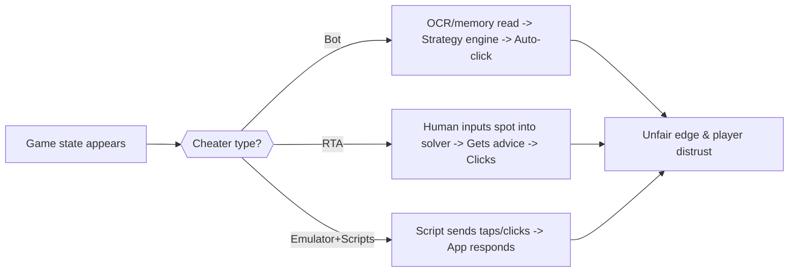
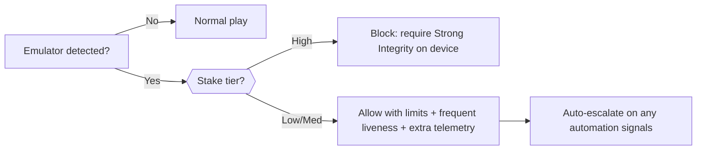

# CoinPoker: Bot & RTA Threat Landscape — Board Briefing

> **Audience:** CoinPoker Board & senior leadership  
> **Style:** Plain English with short technical notes in parentheses  
> **Goal:** Clear view of risks, how bots/RTA operate, and a concrete mitigation plan (Windows client vs emulator users)

---

## 1) Executive Summary
- **Bots** (fully automated players) and **Real-Time Assistance / RTA** (human + solver advice during play) are the two primary integrity threats.
- **Emulator-based automation** (APK on PC) lowers the barrier to scripting, multi-instance, and device spoofing.
- Without strong **client security** (Win11 agent) + **trusted APK telemetry** + **server analytics**, cheaters gain large EV edges and erode trust.
- Our plan: **Harden clients, collect minimal-but-strong telemetry, score in real time, intervene quickly, and communicate bans transparently.**

**90‑Day Action Plan (board-level):**
- Ship **Win11 “Trusted Mode”**: signed client, overlay blocking, process-hash checks, focus checks, input forensics.
- Enforce **APK attestation & emulator detection**; gate stakes/features based on integrity level.
- Launch **risk scoring + liveness prompts**; start quarterly integrity reports (accounts banned, funds recovered).
- Build **OSINT signature feed** (known RTA/bot domains, process hashes, overlay UIs) and maintain continuously.

---

## 2) Threat Overview (plain language)
- **Bot:** Software reads the table and clicks for the user. Plays long hours, no tilt, consistent timing, very few misclicks.
- **RTA:** Human asks a solver **during** hands for the “best” move. Results look superhuman in difficult spots (river/turn mix, rare bet sizes).
- **Emulator automation:** Players run our APK in an **Android emulator** on PC, enabling scripts/macros and multi-instance play.

**Why it matters:** These tools can make a mediocre player perform at expert or near-GTO level, pushing out honest users and damaging brand trust.

---

## 3) Player Types — Comparison (for policy & detection)
| Player Type | Typical Behavior | Tell‑tale Signals | Risk Level |
|---|---|---|---|
| **Human** | Variable timing, small mistakes, natural mouse/touch jitter (**high input entropy**) | Occasional misclicks; timing varies by spot difficulty | Low |
| **Bot** | Perfectly consistent; plays 12–20h/day; handles many tables | Uniform reaction times; zero jitter; acts when window not focused | High |
| **RTA user** | Human clicks, but solver-guided decisions | Solver‑like choices in tough nodes; stable 1.8–2.2s decisions; GTO‑matching frequencies | High |
| **Emulator user** | APK on PC with scripts/macros | Device strings show emulator; “teleport taps” (no path), constant pressure/size | Medium → High |

---

## 4) How Bots & RTAs Operate (simple diagrams)



*(Insert evidence images later here: screenshots of known RTA overlays / bot consoles)*

---

## 5) Detection Pipeline (Win11 client + APK + server)

```mermaid
flowchart TB
subgraph Client
X1[Win11 Client Agent] --> X2[Process & overlay checks (hash/allowlist)]
X1 --> X3[Input forensics (entropy, jitter, focus)]
X1 --> X4[Secure telemetry (minimal indicators)]
end
subgraph Mobile
Y1[APK Telemetry] --> Y2[Integrity/Attestation]
Y1 --> Y3[Touch-path features (teleport, v-std, curvature)]
end
X4 --> S1[Stream]
Y2 --> S1
Y3 --> S1
S1 --> S2[Rules: known bad procs, emulator, background actions]
S1 --> S3[ML: timing, action sequences, solver-likeness]
S2 --> R[Risk Score]
S3 --> R
R --> A1[No action / log]
R --> A2[Liveness prompt / limit tables]
R --> A3[Suspend & review / ban]
```

**Minimal telemetry, strong signals** (examples):
- **Process-hash match** (no raw names); **overlay near table**; **window focus state**
- **Input entropy / mouse jitter** (low = bot-like); **stable think-time bands** in hard spots
- **APK attestation** (device integrity), **emulator fingerprints**; **touch “teleport” rate**

---

## 6) Countermeasures — Checklists

### 6.1 Win11 Client (Trusted Mode)
- [ ] Code-signed; anti-tamper (ASLR/CFG); TLS with cert pinning
- [ ] Overlay control (block non‑allowlisted top‑most windows over table)
- [ ] Process & module inventory (**hash only**; privacy-first)
- [ ] Focus & background‑action checks
- [ ] Input forensics (raw input variance, path jitter, inter‑key CV)
- [ ] Tiered stakes unlock based on integrity checks

### 6.2 Android APK (Trusted Telemetry)
- [ ] Play Integrity attestation (device integrity, strong integrity for high‑stakes)
- [ ] Emulator detection (build props, sensors, GL renderer, package markers)
- [ ] Touch-path features (teleport taps, pressure constancy, toolType/source mismatch)
- [ ] Randomized micro-UI (thwarts OCR bots)

### 6.3 Server Analytics & Response
- [ ] Real-time rules (known bad procs/overlays/emulator -> flag/block)
- [ ] ML models (timing signatures; solver-likeness vs population/GTO)
- [ ] Liveness prompts (human-only gestures; random hotspots)
- [ ] Case tooling (evidence bundles; reproducible reports)
- [ ] Quarterly transparency report (bans, reimbursements)

---

## 7) Emulator Policy (clear & enforceable)



- Default: **No emulators** for high-stakes or finals.  
- Low/medium stakes: conditional allow with liveness and tighter thresholds.  
- One device per account; one session per device; automation scripts strictly prohibited.

---

## 8) “Known in the Wild” (for OSINT & signatures)
- RTA patterns: generic solver overlays; web-based assistants; “chart” popups
- Bot frameworks: OpenHoldem family, commercial wrappers, AHK auto-clickers
- Watchlist inputs: domains, window titles/classes, binary hashes, overlay p‑hashes
- Maintain a living **block/flag list** (rotated weekly; shipped encrypted in client)

*(Insert: placeholders to paste brand logos or UI snippets for internal OSINT)*

---

## 9) Actionable Roadmap (first 90–120 days)
**People & Process**
- Hire/assign **Game Security Investigator**; define strike policy and appeals
- Set up weekly **Integrity Standup** (review signals, tune thresholds)

**Tech Delivery**
- v1 **Win11 Agent** (overlay/process/focus/input); **APK attestation**
- v1 **Risk Scoring** (rules + timing/input features); **Liveness prompts**
- v1 **OSINT feed** of signatures; **Quarterly report** template

**KPIs**
- Time-to-flag (p50) < 5 minutes; False positive rate < 0.5%
- Player trust proxy (support tickets on bots) ↓ 30% by Q2
- Ban/recovery transparency: publish counts per quarter

---

## 10) Glossary (simple first, technical in parentheses)
- **Input entropy:** natural variability in mouse/touch signals (**statistical randomness**); low entropy looks machine-like.
- **Process hash:** cryptographic fingerprint of an executable (e.g., **SHA‑256**), used to identify known tools without reading names.
- **Overlay:** a window drawn above the game (often **always-on-top**) to display advice or capture input.
- **Attestation:** proof an app runs on safe hardware/OS (e.g., **Play Integrity** on Android).
- **Solver-likeness:** degree to which actions match **GTO** recommendations in tough decisions.

---

## Appendix A — Example Minimal Telemetry (JSON)
```json
{{
  "ts": "2025-10-08T17:21:03.123Z",
  "account_id": "abc123",
  "table_id": "tbl-42",
  "hand_id": "h-20251008-001",
  "client": {{
    "trusted_mode": true,
    "overlay_topmost": false,
    "proc_hotlist_hit": false,
    "focus_ok": true
  }},
  "input": {{
    "entropy": 0.74,
    "mouse_jitter": 0.18,
    "keystroke_cv": 0.27
  }},
  "timing": {{
    "decision_open_ms": 0,
    "decision_close_ms": 1950
  }},
  "mobile": {{
    "attestation": "MEETS_DEVICE_INTEGRITY",
    "emulator_suspect": false,
    "teleport_rate": 0.01
  }}
}}
```

---

## Appendix B — Simple Risk Scoring (Python-like pseudocode)
```python
@dataclass
class HandSignal:
    solver_match: bool
    overlay_match: bool
    focus_ok: bool
    rawinput_entropy: float   # 0..1 (low = bot-like)
    mouse_jitter: float       # 0..1 (low = bot-like)
    decision_ms: int
    spot_difficulty: float    # 0..1
    gto_distance: Optional[float] = None

def rule_based_score(sig: HandSignal):
    score = 0.0; reasons = {{}}
    if sig.solver_match: score += 70; reasons["solver_process"] = 70
    if sig.overlay_match: score += 40; reasons["overlay"] = 40
    if not sig.focus_ok: score += 10; reasons["background_actions"] = 10
    if sig.rawinput_entropy < 0.3:
        bump = (0.3 - sig.rawinput_entropy) * 50
        score += bump; reasons["low_entropy_input"] = bump
    if sig.mouse_jitter < 0.2:
        bump = (0.2 - sig.mouse_jitter) * 40
        score += bump; reasons["low_mouse_jitter"] = bump
    if sig.gto_distance is not None and sig.spot_difficulty > 0.7:
        if sig.gto_distance < 0.1 and 1500 <= sig.decision_ms <= 2300:
            score += 25; reasons["solver_like_timing_and_choice"] = 25
    return min(100.0, score), reasons
```

---

## Image Placeholders (drop in later)
- [ ] RTA overlay screenshot (redacted)
- [ ] Bot console/profile editor
- [ ] Emulator settings panel (showing device model string)
- [ ] Liveness prompt UI (in-client)

---

**Contact:** Security Lead / Game Integrity Team — CoinPoker
