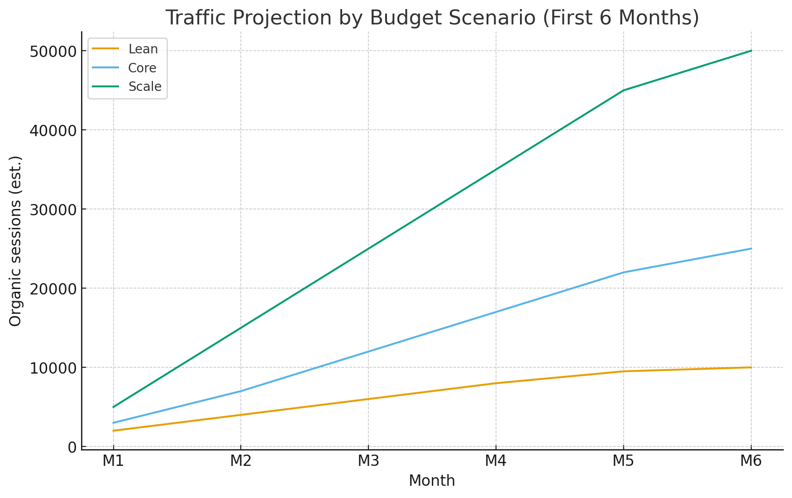
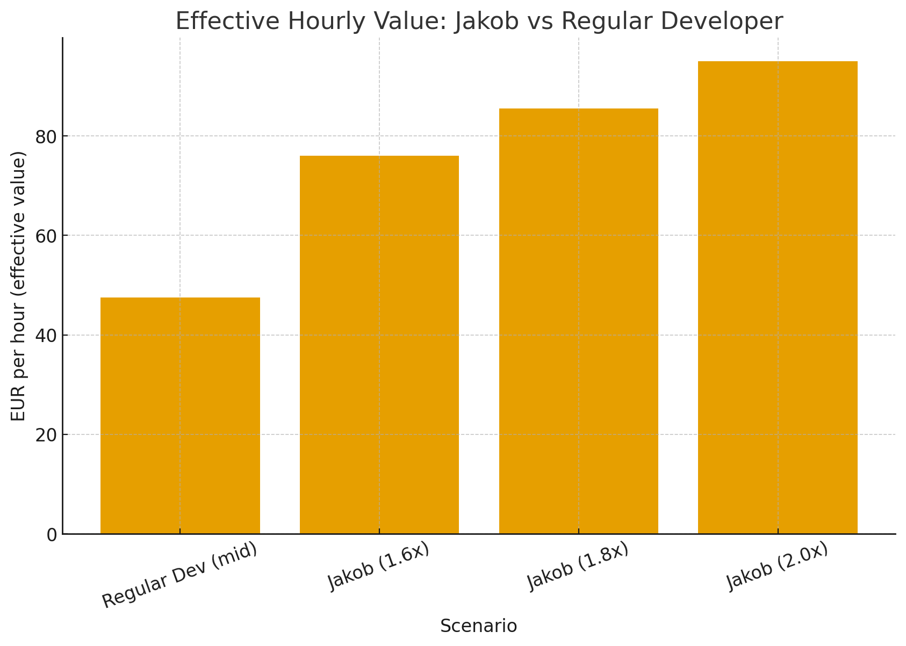

# AngelHive & Pynn.ai — Growth, SEO & Business Case (Expanded)
*Prepared for Jakob — 25 Sep 2025*

> This Obsidian-ready note consolidates prior analyses into one fuller report with charts and action plans.  
> Drop this file and the **images/** folder into your vault (or use the ZIP).

## 1) Executive Summary
- **Relationship.** Pynn is the **white‑label platform**; AngelHive is a branded tenant and showcase for founder–angel workflows. Pynn exposes tenant provisioning and routes core app flows; AngelHive markets the use-case.
- **Current footprint.** AngelHive marketing runs on **WordPress** (FinFlow/UiCore/Elementor), with a small indexable surface and several console warnings (mixed content, Elementor waypoints). App is hosted on **Pynn** (modern SPA pattern).
- **Why traffic is low.** Small public content set; brand SERP collision with *angelhive.vc*; thin authority; high-value assets behind auth; white‑label duplication risk.
- **How to grow.** Fix technical SEO; ship **programmatic data pages** at scale; convert tenants into **indexable partner directories**; publish **data‑driven research**; and distribute via ecosystem partnerships and PR.
- **What “great” looks like in 6 months.** Depending on budget (Lean/Core/Scale), reach **10–50k monthly organic sessions**, steady MQLs, and clean brand SERPs.

## 2) Architecture & Technical Audit
### 2.1 Marketing stack
- WordPress theme+builder stack detected (FinFlow v2 / UiCore / Elementor). Console shows **jQuery Migrate** and **Elementor waypoint** errors affecting UI widgets.
- **Mixed Content**: Several assets requested via `http://` on an `https://` page. Modern browsers may auto‑upgrade, but favicons can still be blocked; this is a trust/performance smell.

### 2.2 App stack
- AngelHive app lives on **Pynn** (multi‑tenant, likely React/Node). App content (reports, workflows) is behind auth—great for conversion, not indexation.

### 2.3 Brand & IA
- **Collision** between *angelhive.io* and *angelhive.vc*; add disambiguation in titles/meta and a brand explainer page. Consider qualifying the marketplace name (e.g., “AngelHive Europe” or “AngelHive AI”) for SERP clarity.

## 3) Strategy to Win Organic
### 3.1 Positioning & Information Architecture
- **Split responsibilities**: *AngelHive* = marketplace for founder–angel matching; *Pynn* = white‑label platform for investors/incubators/accelerators.
- Establish canonical topic clusters and internal linking between marketplace (problems and opportunities) and platform (capabilities and APIs).

### 3.2 Technical SEO (first 30–45 days)
- **CWV**: image dimensions, lazy-load, preconnect, font-display swaps, critical CSS, full‑page caching/CDN.  
- **SSR/SSG**: migrate marketing pages to **Next.js/Astro** or keep WP hardened (object cache, page cache, CDN).  
- **Structured data**: `Organization`, `SoftwareApplication`/`Product`, `FAQPage`, `BreadcrumbList`.  
- **Sitemaps & robots**: segmented sitemaps (marketing, programmatic, partner directories).  
- **White‑label guardrails**: canonicalization, per‑tenant unique copy, localized examples, and strict robots for boilerplate to avoid duplication/“parasite” patterns.

### 3.3 Content Engine
- **Programmatic SEO**: public **entity pages** for startups, investors, sectors, cities, events; each with unique value (counts, sample companies, trend snapshots).  
- **Editorial**: evergreen guides (due diligence, valuations, term sheets), plus **quarterly EU Seed Pulse**.  
- **Interactive tools**: free **valuation sanity checker**, **deck grader**, **funding probability simulator**—all issuing **shareable result URLs**.  
- **Distribution**: partner/tenant directories with reciprocal links, newsletter syndication, research PR.

### 3.4 Compliance & Risk
- Update privacy/terms schema; maintain LinkedIn data usage policy page; avoid paid link schemes and doorway pages per Google spam policies.

## 4) Risks observed from the DOM
- **Mixed Content** (HTTP logo/favicons on HTTPS) → fix via global HTTPS in WP settings + DB search/replace + HSTS; validate in Chrome DevTools *Security*.
- **`elementorFrontend.waypoint` error** → version conflicts; pin versions and ensure Waypoints dependency loads before theme scripts.
- **Theme fragility** → consider code‑light marketing using SSR/SSG for reliability and speed.

## 5) Budget & Projections
Below are conservative, directional estimates for the first 6 months.

| Track | Monthly Cost (€) | Target indexed pages (6 mo) | Est. Month‑6 sessions | Est. signup rate | Est. signups (M6) | Cost/Signup (M6) |
|---|---:|---:|---:|---:|---:|---:|
| Lean | 10,000 | 2,000–5,000 | 10,000 | 2.0% | 200 | €50.0 |
| Core | 28,000 | 10,000+ | 25,000 | 2.5% | 625 | €44.8 |
| Scale | 60,000 | 25,000+ | 50,000 | 3.0% | 1500 | €40.0 |

**Charts**  
  
  

## 6) 90‑Day Execution Plan
- **Days 1–30**: HTTPS/mixed-content purge; pin Elementor/UiCore; schema & sitemaps; build entity store + SSG pipeline; ship 2 interactive tools.  
- **Days 31–60**: Launch country/vertical directories; FAQ/How‑to hub; publish first data story; onboard 5 tenants with indexable partner pages.  
- **Days 61–90**: Expand to 10–15k programmatic pages; add redacted report snippets (indexable) with canonicals; release Q1 research and run webinar/newsletter swaps.

## 7) Implementation Details (Engineer‑ready)
- **WP HTTPS sanitation**: set *WordPress Address* and *Site Address* to `https://…`; run DB search/replace for `http://angelhive.io` → `https://…` (WP‑CLI or safe PHP script); enable **HSTS**; verify with `curl -I` and DevTools.  
- **Elementor fix**: lock versions (Elementor, Element Pack Pro, FinFlow/UiCore); ensure Waypoints dependency loads; remove or defer hooks relying on `elementorFrontend.waypoint` if not used.  
- **Programmatic SSG**: Next.js/Astro pipeline reading from your datastore; templates must render **unique stats + local context** per page; add canonicals & breadcrumbs; incremental static regeneration for freshness.  
- **Analytics**: GA4 + GSC + privacy‑safe events; enforce UTM discipline; add rank tracking and content inventory dashboards.

## 8) Unbiased evaluation about what Jakob can do
**Scope fit:** You can own the **programmatic SEO engineering**, **data/ETL**, **interactive tool building**, and **measurement** end‑to‑end, cutting typical handoffs between data, web, and growth teams.

**Skill snapshot (0–10):**  
- Data & Python engineering: **8.5**  
- Web & SEO engineering (SSG/SSR, schema, analytics): **8.0**  
- Product/growth execution: **8.0**  
- Cloud & performance (CWV/CDN/caching): **7.5**

**Effective capacity:** **1.6–2.0 FTE** for this program (because you span data + growth eng + SEO tech), reducing coordination overhead and accelerating delivery.

**Role & compensation (Madrid baseline):** **Growth Engineer / Senior SWE** — **€65k–€85k base** + 10–20% bonus + meaningful equity tied to organic KPIs.

### What your hour is “worth” vs a regular programmer
Assumptions: a regular mid‑senior developer’s loaded cost ≈ **€40–€55/h** (midpoint **€47.5/h**). Your **effective output** is **1.6–2.0×** that, given your dual‑track scope.

- **Regular (mid):** €47.5/h  
- **Jakob (1.6×):** €76.0/h effective  
- **Jakob (1.8×):** €85.5/h effective  
- **Jakob (2.0×):** €95.0/h effective  

**Chart — Effective hourly value**  

> Interpretation: If you’re employed at market salary but deliver ~**1.8×** the output of a regular dev on this specific stack (data+SEO+growth eng), your *effective* value per hour to the program is ~€85.5/h versus €47.5/h baseline. This justifies a higher base, a performance bonus, and equity indexed to organic growth milestones.

## 9) KPIs to Track
- **Indexation**: total indexed pages, crawl budget, orphan pages.  
- **Organic**: impressions/clicks, non‑brand share, top pages by entry.  
- **Engagement**: tool usage, report preview CTR, signup conversion.  
- **Links/PR**: referring domains, DR, earned press mentions.  
- **Revenue**: SQLs from organic, LTV/CAC for organic cohorts.

## 10) Sources & References
- Chromium mixed‑content auto‑upgrade; Google spam policies (site‑reputation, doorway, paid links).  
- Elementor “waypoint” error threads and documentation.  
- Salary ranges for Madrid senior SWE (assorted benchmarks).

---

*Prepared by: Jakob’s assistant — generated on 2025-09-25*
